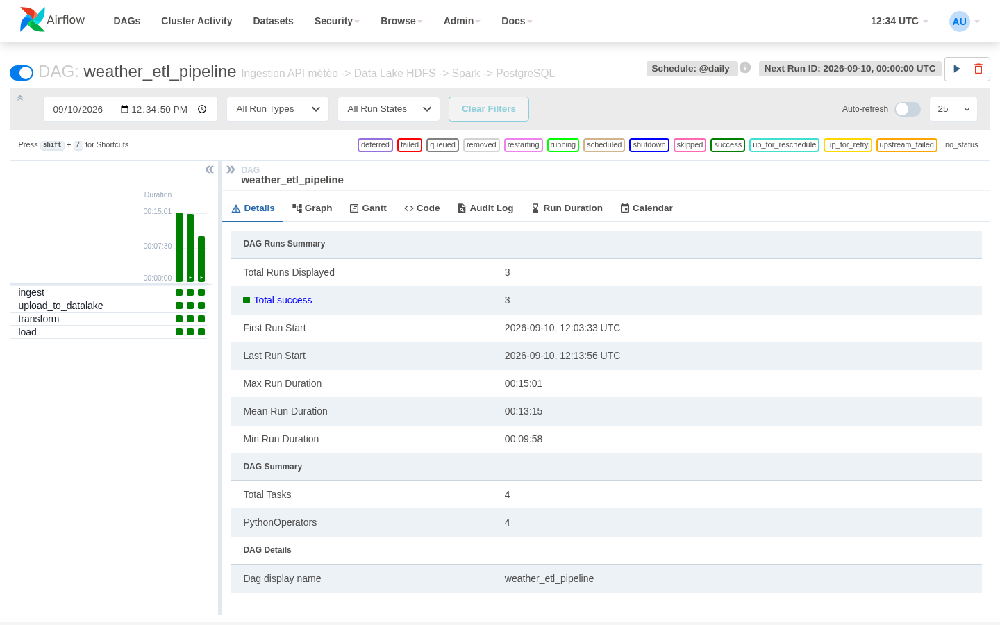
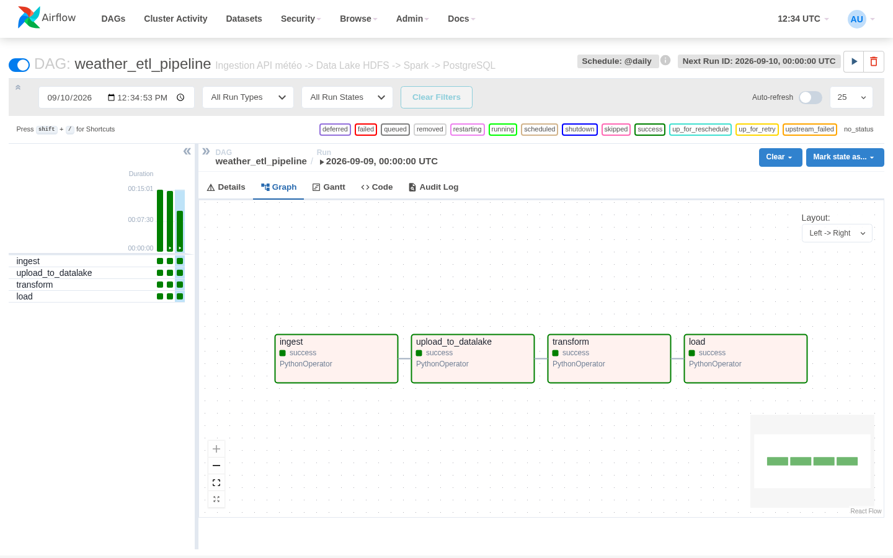
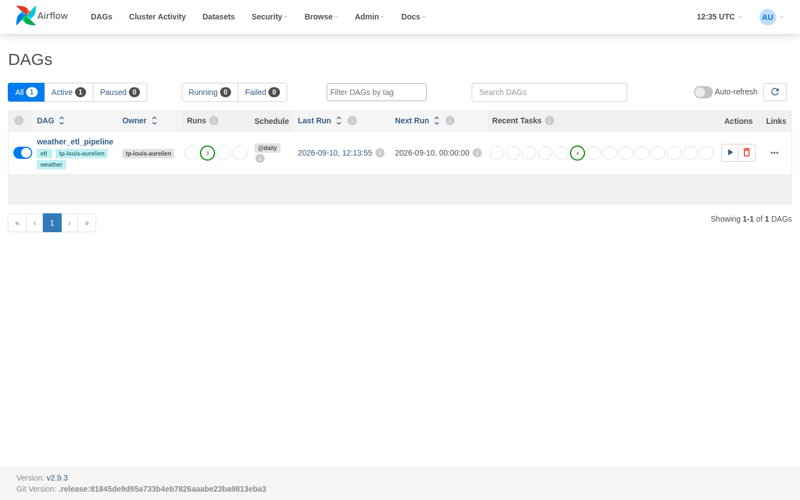
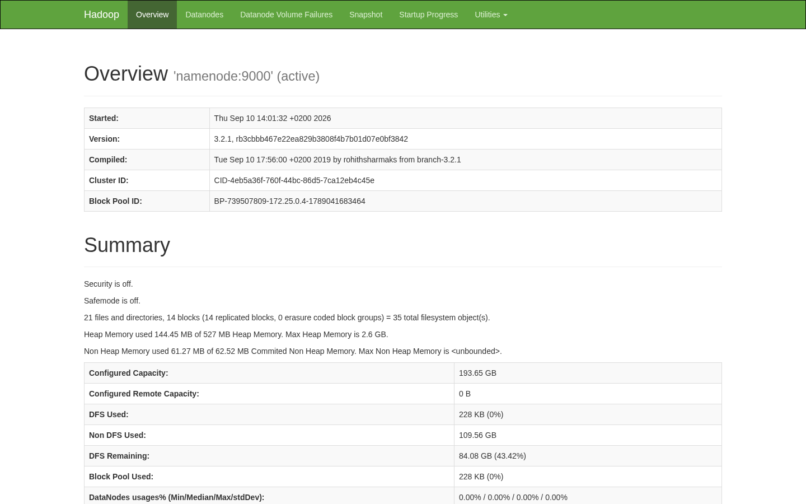
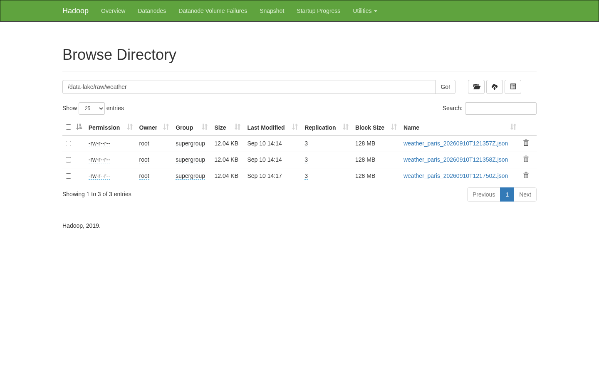
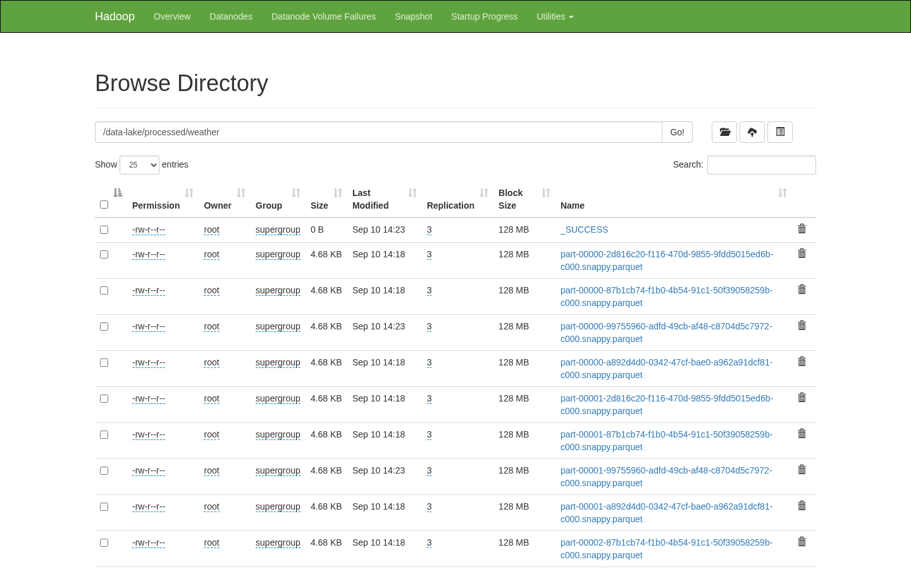
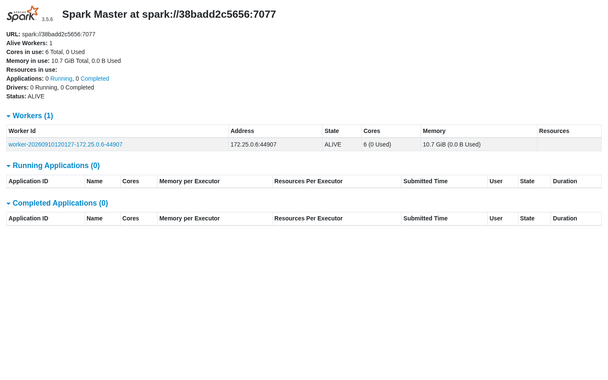

# Rapport d'analyse — Pipeline de données TP Louis Aurélien

Captures d'écran d'une exécution réelle et complète du pipeline (ingestion → Data Lake HDFS →
transformation Spark → Data Warehouse PostgreSQL), déployé via Docker Compose sur un serveur Linux
distant. Le DAG `weather_etl_pipeline` a été exécuté avec succès à plusieurs reprises.

## 1. Airflow — vue d'ensemble du DAG

3 exécutions complètes, toutes en succès, des 4 tâches `ingest → upload_to_datalake → transform → load`.

## 2. Airflow — graphe des dépendances

## 3. Airflow — liste des DAGs

## 4. Data Lake HDFS — vue d'ensemble du cluster

## 5. Data Lake HDFS — données brutes ingérées

Un fichier JSON par exécution du DAG, horodaté.

## 6. Data Lake HDFS — données transformées (Parquet)

Fichiers Parquet produits par le job Spark, avec marqueur `_SUCCESS`.

## 7. Cluster Spark

